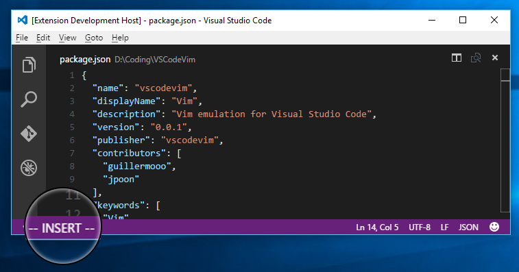

 

# Vim

VSCodeVim is a [Visual Studio Code](https://code.visualstudio.com/) extension that provides Vim keybindings within Visual Studio Code. 

**Please direct any questions about missing/incomplete features to [our Github Issues page](https://github.com/VSCodeVim/Vim/issues).** We'll do our best to get back to you quickly! We've added a lot of functionality, but everyone uses Vim in their own special way, so let us know if we're missing your favorite obscure command. :wink:

If you want to talk with us directly, drop by our Slack channel above! We hang out there and are pretty friendly :smiley:

## Install

1. Within Visual Studio Code, open the command palette (`Ctrl-Shift-P` / `Cmd-Shift-P`)
2. Select `Install Extension` and search for 'vim' *or* run `ext install vim`

## Configure

Adjust configurations through user settings (File -> Preferences -> User Settings).

* vim.keyboardLayout: 
    * Supported Values: `en-US (QWERTY)` (default), `es-ES (QWERTY)`, `de-DE (QWERTZ)`, `da-DK (QWERTY)`
    
## Project Status

Check out our [release notes](https://github.com/VSCodeVim/Vim/releases) for more notes.

[Check the Roadmap](https://github.com/VSCodeVim/Vim/blob/master/ROADMAP.md) for our future plans.

## Contributing

See [here](https://github.com/VSCodeVim/Vim/blob/master/DEVELOPING.md) for how to run a development environment and make contributions.

[Check the full list of commands](https://github.com/VSCodeVim/Vim/blob/master/ROADMAP.md) if you're having trouble thinking of things to add! :wink:

This project is maintained by a group of awesome [contributors](https://github.com/VSCodeVim/Vim/graphs/contributors). *Thank you!* :heart: 

## License

[MIT](LICENSE.txt)
